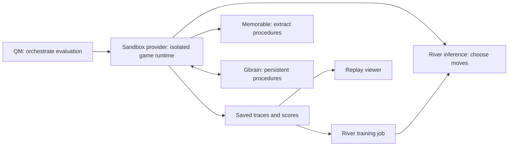

# Pac-Man agent components

QM is the agent harness and control plane. It exposes an execution tool and a
sandbox-provider interface. Agent37 or another configured provider supplies the
isolated compute. A hosted QM installation can bundle these pieces, but they
remain separate responsibilities.

- **Inside the game runtime:** Python environment, `play_one.py`, policy client,
  memory client, and per-move replay guards. River hosts the model remotely.
- **Outside disposable compute:** durable Gbrain state, exported traces, River
  checkpoints, and the replay viewer. Export trace artifacts before teardown.
- **After a run:** send validated executed actions to Memorable; persist its
  returned draft in Gbrain; retrieve and validate it before replaying next time.
- **Training:** submit selected traces through River separately. Deleting a game
  sandbox must not interrupt or delete a training job or its checkpoint.

This is the intended full-system architecture. This repository currently
implements the memory clients and replay logic, not a deployed QM/game runtime.
The memory adapter supports authenticated hosted HTTP MCP and a local Gbrain
CLI. When `GBRAIN_MCP_URL` and `GBRAIN_ACCESS_TOKEN` are both configured, hosted
transport is selected automatically. `GBRAIN_TRANSPORT=local` explicitly selects
the local CLI. Hosted writes stay under the app's `pacman-memory/` namespace;
recall fetches and validates canonical pages so a fresh worker needs no copy of
the laptop's JSON cache. Live Memorable extraction and hosted Gbrain write,
search, and retrieval have been verified with synthetic data only.

See [sandbox comparison](sandbox-options.md) and [QM integration handoff](qm-handoff.md).
