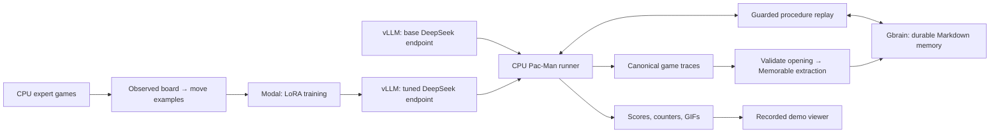

# PacBrain architecture

The integrated implementation runs the Pac-Man game on a CPU, calls a model endpoint when it needs a move, and reuses a stored opening only while fresh observations satisfy its guards. Modal training and model serving are separate from game execution.

## One episode

1. Reset the game with a declared layout and seed.
2. When memory is enabled, retrieve compatible procedures from Gbrain and create a new replay cursor.
3. Before every move, check the current board, position, legal moves, ghost distance, and terminal state. A matching procedure supplies one move; otherwise the policy endpoint supplies the next proposal.
4. Validate policy output and use a legal fallback when a request or parse fails. Log the actual source and outcome; do not count a rejected proposal as an executed move.
5. Save the observed trace and evaluation counters. A completed trace can be ingested into Memorable and Gbrain after the game.

See [the exact trace contract](../contract.md). The environment owns scores and execution outcomes. A final game score cannot substitute for missing per-step observations.

## Memory and training are distinct

Training updates model weights. Procedural memory stores an observed action sequence plus the conditions under which it may be replayed. Gbrain owns persistence and retrieval; Memorable converts validated executed actions into a procedural draft. The application checks that draft against the actual trace.

The checked-in before/after results compare the base and tuned model. They do not measure the effect of memory. A memory evaluation needs the same model, seeds, and settings with memory disabled and enabled, with the memory set frozen before evaluation.

## Deployment boundaries

API keys belong in private runtime configuration. Gbrain supports either an isolated local CLI/PGLite store or authenticated HTTPS MCP. Hosted writes stay under `pacman-memory/`; recalled text is parsed as data, never executed as a command.

`modal_train.py` and `modal_serve.py` define the supplied GPU path. Their presence does not prove an active deployment in the current account. A future Modal game sandbox can invoke the same CPU runner. It is not required for the local demo viewer, and no new cloud job is launched by installing dependencies or running offline tests.
