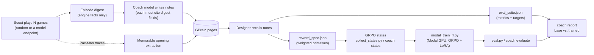

# Coach: from play to a training signal

The coach is the half of PacBrain that runs before training. It plays a game many times, writes notes about what happened into memory, and reads those notes back to design the reward function and eval suite that the Modal GRPO trainer consumes. Nothing in `coach/` is specific to Pac-Man: a game plugs in by declaring its rules, actions, reward primitives and eval metrics. Pac-Man (via pacai) and a built-in Flappy Bird clone are included.



## Steps

1. **Scout** (`coach/scout.py`). Plays one game per seed. Pac-Man runs in the pacai engine through `coach/scout_agent.py`; Flappy Bird runs in process. Each episode becomes a digest of facts the engine observed: score, turns, how it ended, illegal-output rate, action counts and game-specific details (for Pac-Man: pellets, when it was caught, closest ghost, stops and reversals; for Flappy Bird: pipes, crash type, flap rate, distance from the gap).
2. **Notes**. The coach model writes 1–6 notes per episode. Every note must cite digest fields as evidence, and notes citing anything else are rejected. Notes are saved as Markdown pages and imported into GBrain under the app's `pacman-memory/` namespace. With `--memorable`, Pac-Man traces also go through the existing Memorable opening extraction (`memory.service.ingest`).
3. **Design** (`coach/designer.py`). Recalls the notes from GBrain and asks the coach model for a reward and an eval suite. The model can only combine the game's declared primitives; the reply is validated (known names, finite bounded weights, a negative illegal-output reward, 2–8 known metrics) and must cite the notes it relied on. Output: `generated/<game>/reward_spec.json`, `eval_suite.json` and `design.md`, and the design is saved back to memory.
4. **Train**. `compile_reward` turns a spec into the same `{action: reward}` tables `rewards.py` produces. For Pac-Man, `COACH_REWARD_SPEC=… python collect_states.py` builds GRPO states with the designed reward; for Flappy Bird, `python -m coach states`. `modal_train_rl.py` accepts `--game` and `--illegal-reward`.
5. **Report**. `python -m coach report` scores base and trained results against the designed suite.

## Commands

```bash
cp .env.example .env   # set COACH_ENDPOINT, COACH_MODEL, and the Memorable/GBrain values
python -m coach run --game pacman --episodes 20 --memorable
COACH_REWARD_SPEC=generated/pacman/reward_spec.json python collect_states.py 150 3000 rl_states_coach.jsonl
modal run --detach modal_train_rl.py --states-file rl_states_coach.jsonl --illegal-reward <from spec> --out-dir /vol/rl_coach
python eval.py --endpoint <rl_coach-endpoint>/v1 --label rl_coach
python -m coach report --game pacman --suite generated/pacman/eval_suite.json --base results/base.json --tuned results/rl_coach.json

# The same loop on Flappy Bird
python -m coach run --game flappy --episodes 30
python -m coach states --game flappy --spec generated/flappy/reward_spec.json
modal run --detach modal_train_rl.py --game flappy --states-file flappy_states.jsonl --illegal-reward <from spec> --out-dir /vol/flappy_rl
python -m coach evaluate --game flappy --endpoint <flappy_rl-endpoint>/v1 --label flappy_rl
```

`--memory none` keeps notes in `data/coach/memory/` and reads them from there instead of GBrain. The coach model is any OpenAI-compatible chat endpoint.

## Adding a game

Add a module under `coach/games/` and register it in `coach/games/__init__.py`. It must define `NAME`, `DESCRIPTION`, `ACTIONS`, `REWARD_PRIMITIVES`, `EVAL_METRICS`, `legal_actions(state)`, `primitive_values(state, action)`, `play_episodes(seeds, endpoint=None, label=…, max_turns=None, trace_dir=None)`, `digest_extras(episode)` and `episode_metrics(episodes)`. Add its move words to `GAME_ACTION_WORDS` in `modal_train_rl.py`. `coach/games/flappy.py` is a complete example in about 250 lines.

## Status

Implemented and covered by offline tests (`tests/test_coach.py`). The Pac-Man scout has been run against the real pacai engine with random play, and `coach/specs/pacman_handwritten.json` reproduces `rewards.py` exactly (identical reward tables on 26 states from seed 3100). The coach has **not** yet been run with a live coach model, GBrain or Memorable, and no model has been trained on a coach-designed reward. The checked-in GRPO results (`results/rl.json`, `results/rl2.json`) were trained with the hand-written `rewards.py`.
