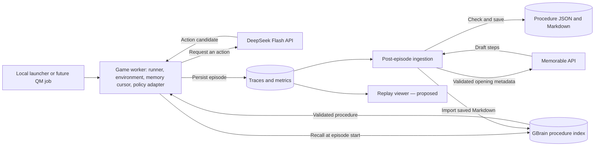

# Pac-Man system design with DeepSeek Flash

Design proposal, September 27, 2026. This document distinguishes existing memory code from the proposed game runner and deployment. It does not claim end-to-end gameplay or hosted execution has been demonstrated.

## Product behavior

The agent plays Pac-Man using DeepSeek Flash when it needs an action. After an episode, it can preserve a verified, positively rewarded opening as a reusable procedure. In later episodes, it replays that opening one move at a time while its preconditions hold, reducing the number of model calls. The environment remains the authority on what actually happened.

For this proposal, DeepSeek is the primary action policy. Earlier repository documents name River as the policy/training integration. River's continuing role is unresolved; it is not a required second model in this MVP. The policy adapter should allow an alternative implementation later.

The API model is `deepseek-flash`, with base URL `https://api.deepseek.com` and the Chat Completions endpoint `/chat/completions`, according to the [official DeepSeek integration documentation](https://api-docs.deepseek.com/guides/harness). A live authenticated request has not been performed for this design.

## Design options

| Option | Decision flow | Purpose and tradeoff |
| --- | --- | --- |
| Model-only baseline | Observation → DeepSeek → validate action → game | Establishes gameplay and a reference for calls, latency and scores. Requires an API decision for every normal move. |
| Memory-first agent — recommended MVP | Observation → guarded opening replay; DeepSeek takes over when replay stops | Fits the memory implementation already present. Reuse depends on matching layout, topology and expected positions. |
| Planner plus local controller — later experiment | DeepSeek chooses a short goal; a controller executes and replans | Could reduce API calls beyond the opening, but requires a new controller, goal contract, interruption rules and separate evaluation. It is not supported by the existing replay cursor. |

Build the baseline and memory-first modes in the same runner. Keep planner/controller work outside the initial scope.

## Components and deployment

These are logical components, not a requirement for separate services. Start with one Python runner and serialized post-episode ingestion on one machine. DeepSeek and Memorable are external APIs. The current GBrain adapter is a local CLI backed by isolated PGLite storage; procedure JSON/Markdown and traces must persist across worker lifetimes.

The sandbox is the execution boundary around the game worker. It runs the game and application code; DeepSeek inference runs at the API provider. No sandbox provider has been selected or implemented in this checkout. A hosted worker needs its game dependencies, private API credentials, outbound API access and persistent artifact storage.

QM can later launch the same evaluation entry point. For a remote worker, either import an explicit memory snapshot into a worker-local GBrain or implement the authenticated remote MCP transport described in [the QM handoff](qm-handoff.md). The current Python adapter does not implement remote MCP. Do not share a PGLite database across concurrent processes; serialize CLI access and ingestion.

## Exact episode lifecycle

1. **Initialize.** Select layout, seed, maximum turns, model configuration and memory-enabled flag. Reset the environment and obtain an authoritative initial observation.
2. **Recall once.** When enabled, call `recall_procedure(layout, observation, provider="gbrain")`. It searches GBrain, retrieves canonical pages, validates their procedure envelopes and selects a compatible candidate. Create a new `ProcedureCursor` for this episode. Surface a provider failure separately from an ordinary no-match result; the proposed runner can continue with DeepSeek and record `memory_unavailable`.
3. **Observe.** Obtain the current ASCII board, score, legal moves and terminal state. The proposed MVP uses a step-driven environment: game state advances only on `env.step(action)`, so the board does not change during an API request. This requirement must be verified with the gameplay teammate.
4. **Try replay.** Call `cursor.next_action(observation, layout)` exactly once for the move about to be attempted. The existing cursor checks layout, wall topology, expected position, legality and active-ghost distance. A passing check returns one stored action. Completion or a failed check permanently stops this cursor for the episode.
5. **Use DeepSeek if needed.** Send the current board, coordinate convention, legal actions, objective and a bounded recent action history. Request one JSON action, for example `{"action":"E"}`. Do not ask for executable code or an unvalidated action batch. The proposed adapter must parse the response and require one of `N`, `S`, `E`, `W` that is legal in the current observation. Legal does not mean strategically safe.
6. **Execute and log.** The runner alone calls `env.step(action)`. Record the pre-action observation, the action actually attempted, the actual execution outcome when known and the actual source. Fetch the next observation before the next decision. If the environment rejects a recalled action, abandon its cursor.
7. **Finish.** Stop on the environment's terminal state or the turn/time budget. Save the terminal observation, outcome, trace and measured counters, then run ingestion separately from the per-move loop.

Proposed failure behavior: configure an API deadline and at most one retry within the episode budget. On persistent API failure, malformed output or an illegal candidate, use a deterministic legal fallback (prefer greater maze-path distance from active ghosts, with a fixed tie-break). If there is no legal action, stop and record the condition. A fallback is not a safety guarantee. Log it as `source: fallback`; the existing extractor then stops at that point rather than attributing the move to the policy.

If the game is real-time instead, associate every request with an observation version and reject stale results. That is additional runner work; do not apply old API decisions to a moving board.

## Memory creation and limits

The existing ingestion flow first independently validates a contiguous opening, capped at 40 steps by default, with positive total observed reward. Every included transition must be supported by the next observation. It checks positions, topology, legal moves, danger and known deaths, and stops at unsupported or fallback transitions.

It sends only the selected game-action metadata to Memorable. The returned draft must contain exactly the validated action sequence. A mismatch is rejected. The service saves the envelope, including provenance and the extraction receipt, as JSON and Markdown before importing it into GBrain. If indexing fails, the local extraction remains saved and the failure is surfaced.

Current recall is **opening replay**, not general state-based strategy retrieval. It selects candidates using exact layout compatibility and cursor checks, ranking eligible procedures by observed reward and length. It does not calculate a calibrated success probability. Ghost checks are local heuristics, not proof that the next state is safe; replay also does not require identical pellet placement. No model weights are updated by this loop.

## Proposed integration contracts

| Interface | Input | Output |
| --- | --- | --- |
| Evaluation runner | Layout, seed, memory flag, model, turn/time budgets | Episode result, trace location and metrics |
| Environment adapter | Reset configuration or one legal action | Authoritative observation, reward and terminal state |
| DeepSeek policy adapter | Current observation, legal actions, bounded recent history | Parsed action candidate and measured API metadata |
| Existing memory recall | Layout and initial observation | Validated procedure or no match, plus provider metadata |
| Existing ingestion | Completed pre-action trace | Saved procedure/index receipt, or explicit rejection/error |

Preserve the existing [trace contract](../contract.md). DeepSeek-executed choices use `source: policy`; recorded procedure choices use `source: procedure`; corrections use `source: fallback`. Proposed extra metadata includes policy provider/model, request latency, usage when returned, procedure ID, cursor step and fallback reason. Provider API credentials belong in private runtime configuration, not traces or browser code.

## Demo and implementation scope

1. **Working baseline:** connect the real environment and DeepSeek adapter, validate all executed actions and produce an inspectable real trace.
2. **Memory ingestion:** extract a real rewarded opening with Memorable, save it and verify GBrain recall.
3. **Memory-enabled run:** show recalled moves, a fresh board check for every move and an observable handoff to DeepSeek when replay ends or conditions change.
4. **Comparison:** evaluate model-only and memory-first modes on the same declared layouts and seeds. Freeze the memory set before evaluation and distinguish familiar seeds from held-out seeds. Measure score, survival/clear rate, actual API attempts, procedure actions, fallback reasons, total latency and token usage. Report ingestion usage separately. Fewer calls alone does not establish better gameplay.
5. **Hosted execution:** only after the local loop works, package the runner for the selected sandbox and optionally QM. Verify persistent memory/artifact access from that worker.

Existing: deterministic extraction, replay cursor, local persistence, Memorable adapter, GBrain CLI integration and tests. Still to build/connect: playable environment, DeepSeek adapter, runner/error handling, evaluation harness, viewer and hosted worker. The repository documents a real GBrain round trip with synthetic data; Memorable live extraction and gameplay benefit still require real execution evidence.

Open team decisions: whether River still has a separate role, which sandbox/QM runtime to use, and whether the supplied game supports step-driven execution. These do not prevent defining or building the local memory-first runner.
