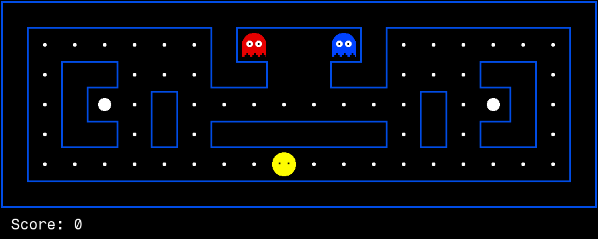

# PacBrain: recorded evaluation results

Metrics are recomputed from checked-in per-game observations. Generating this report does not rerun inference.

| saved run | games | avg score | win rate | invalid-response / error rate |
|---|---|---|---|---|
| base | 10 | -428.1 | 0% | 82.5% |
| tuned | 10 | 387.1 | 50% | 0.0% |
| tuned_t04 | 10 | -258.4 | 0% | 0.0% |

The original `illegal` counter includes unparsable or unavailable model responses and API exceptions before a legal fallback action. It is not a count of illegal actions executed by the engine.

The three legacy artifacts share seeds 2000–2009. They do not record a checkpoint hash, decoding configuration, package versions or training duration. These saved outcomes do not establish a controlled before/after comparison, an eight-minute training time, or a benefit from memory. The tuned_t04 filename alone does not verify temperature.

## Before (base model)

## Tuned run

