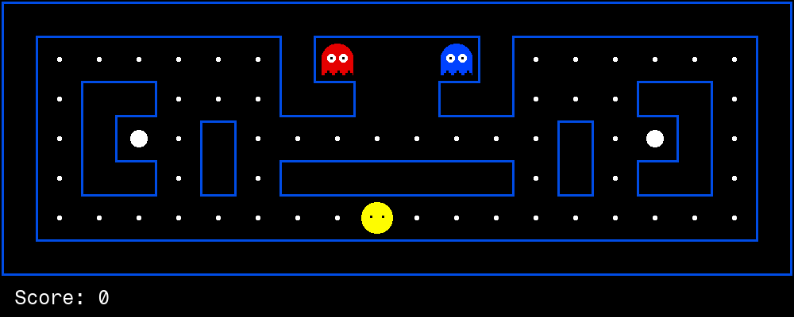

# PacBrain: DeepSeek learns Pacman from rewards alone

Same 1.5B DeepSeek model before and after GRPO reinforcement
learning — no expert imitation, only the game's own score as reward.
Identical prompts, seeds, and board. Metrics are recomputed from
checked-in per-game observations; this report does not rerun inference.

| model | games | avg score | win rate | invalid-response rate | pellets | ghosts eaten | deaths |
|---|---|---|---|---|---|---|---|
| base | 10 | -428.1 | 0% | 82.5% | 109 | 0 | 10 |
| rl | 10 | -422.1 | 0% | 0.0% | 116 | 0 | 10 |

The `illegal` counter includes unparsable or unavailable model responses and API exceptions before a legal fallback action.

Training checkpoints (reward per step): `results/training_curve.json`.

## Before (base model)

## After (reward-trained, GRPO)

